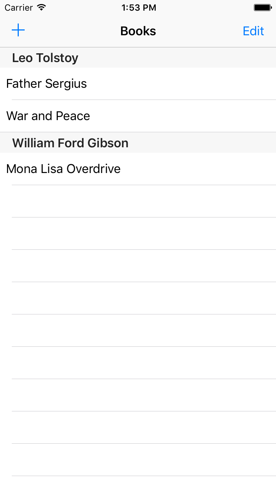
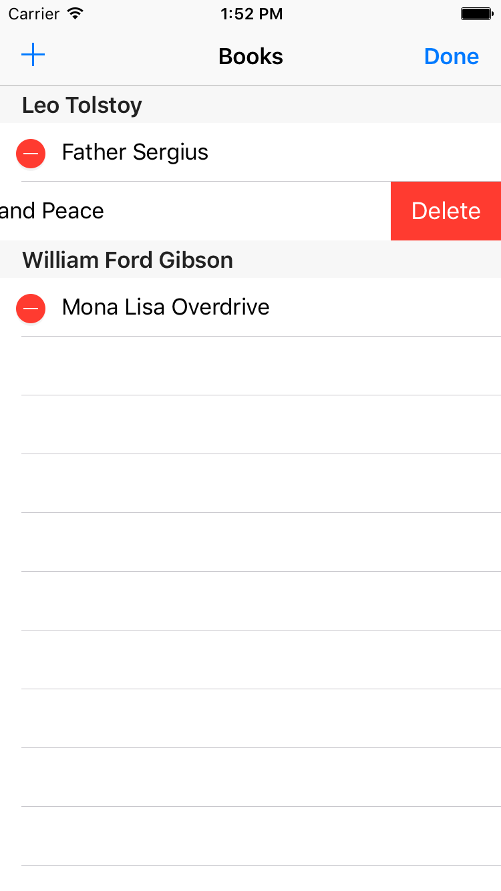
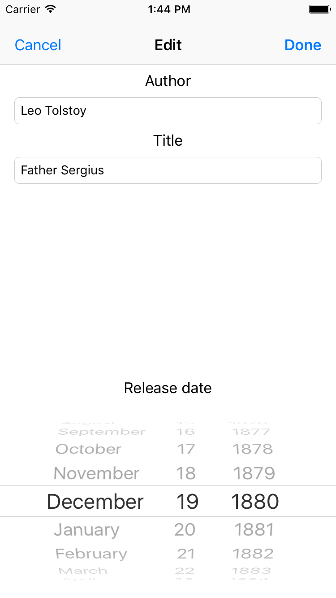

# examples-ios-fmdb

Example for the [FMDB](https://ccgus.github.io/fmdb/).

## Installation

1. Setup the [CocoaPods](https://cocoapods.org/)
2. `git clone` this repository
3. `cd REPOSITORY_DIR`
4. `pod install`
5. Open the `*.xcworkspace` file on the Xcode
6. Build and Run the project

## Description

Example for the FMDB with **Objective-C** and **Swift**, it's an application to manage simple book information.

* UsingFMDB-Objective-C
* UsingFMDB-Swift

| Read | Delete | Create/Update |
|:--:|:--:|:--:|
|  |  |  |

## License

* [MIT](LICENSE)
